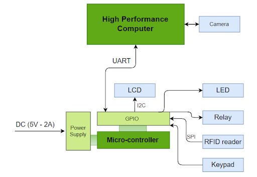
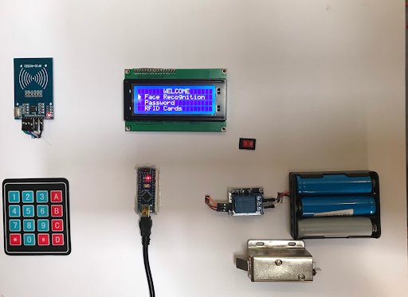

# SMART DOORLOCK SYSTEM
### SYSTEM REQUIREMENTS
### 1.Engineering requirements:
Operating DC voltage : 5v
### 2.User requirements:
- **Requirement1:** The user can open the door via 2 modes: RFID, facial identification.
- **Requirement2:** The system has a security mode that allows users to type passwords for emergencies.
- **Requirement3:** The system will alarm and lock itself if the user types or gets the wrong password, or uses the RFID tag incorrectly too many times.
- **Requirement4:** The system can register a new RFID tag and remove an RFID tag.
- **Requirement5:** The communication protocol for the Laptop and Arduino will use UART.

### BLOCK DIAGRAM 

- **Power Supply:** provides power for the entire system to operate at 5v dc.
- **Input Block:** receives the signal from users using a keypad and transfers it to the central processing block to decide the suitable functions to operate.
- **Sensing Block:** reads signals from the RFID reader and PiCamera and then sends to the central block to activate the functions and display block to show the current state of the system for users.
- **Displaying block:** displays the current status of the system and necessary information to the users through LCD.
- **Output block:** receives control signals from the central processing block. If the signal satisfies any conditions of the system, the system will open the door using relays.
- **Central Processing Block:** processes input data and control signals received from the sensing block and input block and then outputs the control signal to the display and output blocks
### PROJECT

